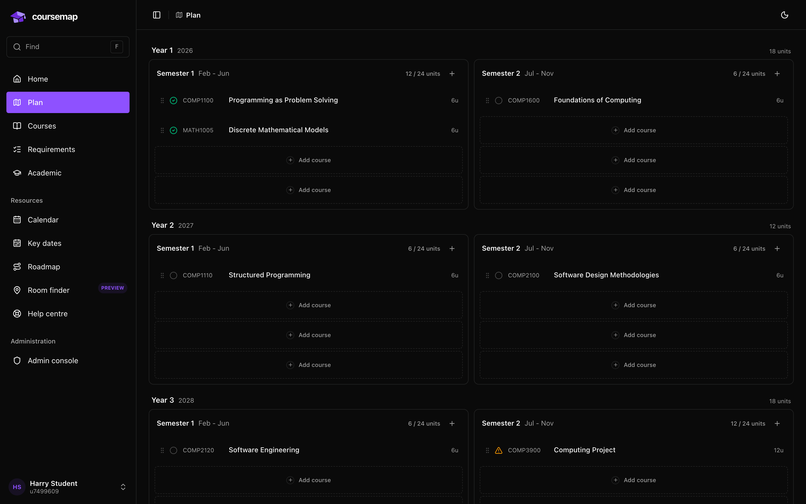
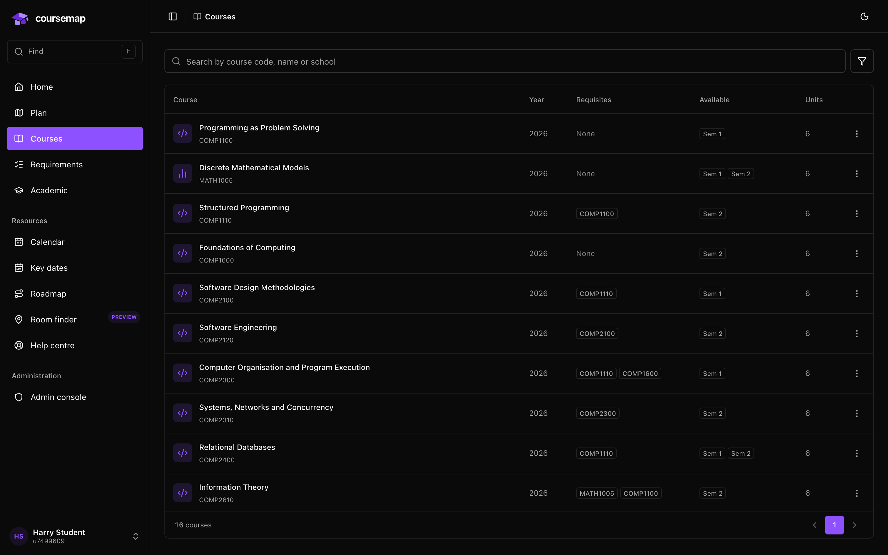

<div align="center">


# Coursemap

**Plan an ANU degree you can actually explain.**

Prerequisite paths, requirement audits, campus room finding and every key date,
in one place that updates when the catalogue does.

[](https://github.com/HarryRandall/anu-coursemap/actions/workflows/ci.yml)
[](https://nextjs.org)
[](https://supabase.com)
[](https://pnpm.io)

<picture>
  <source media="(prefers-color-scheme: dark)" srcset="docs/images/plan-dark.png" />
  <source media="(prefers-color-scheme: light)" srcset="docs/images/plan-light.png" />
  
</picture>

</div>

## What it does

Degree planning at ANU usually means a PDF, a spreadsheet and a lot of hope.
Coursemap replaces that with something that checks its own work.

- **Plan board.** Drag courses across years and semesters. Unit loads total
  themselves, and a course whose prerequisites are not met is flagged in place
  with a suggested fix.
- **Requirement audits.** Your plan is checked against the published programme
  rules, so you find the gap in second year rather than in final year.
- **Prerequisite graphs.** See what a course unlocks and what it needs first.
- **Room finder.** Find a room on campus, including a 3D view inside the
  building rather than a flat floor plan.
- **Key dates.** The ANU university calendar, scraped through a reviewable
  pipeline instead of copied by hand.
- **Catalogue administration.** Imports are proposals. A human reviews every
  extraction before it is published, and nothing overwrites a working draft
  silently.

<div align="center">
  
</div>

> [!NOTE]
> Coursemap is an independent tool and not an official ANU system. Confirm your
> study plan against Programs and Courses and your college's academic advice.

## Quick start

You need Node 24, Docker and the Supabase CLI. pnpm comes from the
`packageManager` field, so any recent pnpm can bootstrap it.

```bash
pnpm install
cp apps/web/.env.example apps/web/.env.local
pnpm db:start      # local Supabase stack
pnpm db:reset      # migrations plus demonstration fixtures
pnpm dev:local     # http://127.0.0.1:3000
```

Sign up at `/signup` and the local stack issues a session straight away. To run
against a hosted Supabase project instead, put its URL and publishable key in
`apps/web/.env.local` and use `pnpm dev`.

Development uses webpack, matching production builds, to avoid a Turbopack
hot-reload panic (`VersionedContents` cells no longer exist).

## How it is built

A pnpm workspace with Turborepo task caching.

```
apps/web        Next.js 16 App Router application
  app/          routes, layouts and their colocated page components
  ui/common/    Coursemap components shared across areas
  ui/<area>/    components for one feature area
  lib/          domain logic, data access and parsing
packages/ui     vendored ReUI design system, primitives and theme
supabase/       migrations, RLS policies and pgTAP tests
```

Two rules keep it honest. `packages/ui` knows nothing about courses or plans,
which a test enforces. Every dependency version lives in the `catalog:` block of
`pnpm-workspace.yaml`, so no package can drift onto its own version of React.

Domain logic stays out of components, durable data stays in Postgres behind Row
Level Security, and the service-role key never reaches the browser.

## Commands

| Command          | What it does                                   |
| ---------------- | ---------------------------------------------- |
| `pnpm dev:local` | Development server against local Supabase      |
| `pnpm check`     | Formatting, lint and strict types              |
| `pnpm test`      | Unit and component tests                       |
| `pnpm test:e2e`  | Authenticated browser journeys                 |
| `pnpm db:reset`  | Rebuild the local database and reseed fixtures |
| `pnpm db:test`   | pgTAP database tests                           |
| `pnpm db:types`  | Regenerate committed database types            |
| `pnpm verify`    | Local application delivery checks              |

Run `pnpm verify` before opening a pull request. CI additionally runs database
checks, authenticated browser journeys and a production dependency audit. See
the [verification matrix](CONTRIBUTING.md#verification).

## Documentation

[Contributing](CONTRIBUTING.md) ·
[Architecture](docs/architecture.md) ·
[Catalogue workspaces](docs/catalogue-workspace-refresh.md) ·
[Documentation index](docs/README.md) ·
[Code conventions](docs/conventions.md) ·
[Database setup](supabase/README.md) ·
[Security policy](SECURITY.md) ·
[Agent guide](AGENTS.md)

<div align="center">
<sub>Screenshots use demonstration fixtures, not real student records.</sub>
</div>
